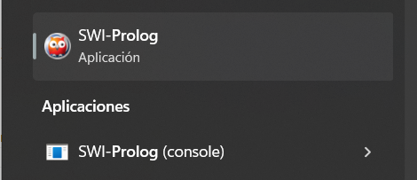

<p align="center"></p>

# 02 - Instalación

## Instalando PROLOG
Accede a la página oficial de [SWI-PROLOG](https://www.swi-prolog.org/Download.html) y en descarga la versión adecuada para tu ordenador según tu sistema operativo. 

Durante la instalación sigue las instrucciones, es muy recomendable permitir que instale el programa en el PATH (**add swipl to the system PATH**), de esta forma podremos usarlo desde cualquier terminal y facilitar las tareas. 

Una vez instalado encontrarás distintas cosas en tu ordenador:

<p align="center">

</p>

* **SWI-Prolog**: El programa por defecto de PROLOG, este abre una terminal con el compilador y herramientas cargadas. A continuación veremos de forma básica como manejarse con este. 
* **SWI-Prolog (console)**: Esto es una consola similar a CMD de windows o la consola de MacOS. No vamos a utilizarla. 

Abre **SWI-Prolog**, tendrás ante ti una consola donde puede introducir los distintos comandos. 

<p align="center">

</p>

Como norma general la estructura básica de los comandos para SWIPL es la siguiente

    <nombre_comando>.

Como puedes observar después de cada comando u orden tendremos que escribir un punto, dando a entender al interprete que hemos terminado de escribir la orden. Esto es algo similar al ``;`` que habrás visto en otros lenguajes de programación, de esta mandera le explicamos a SWIPL que ahí termina nuestra instrucción. 

Lo que tienes ante ti es una consola, las consolas nos permiten dar ordenes a nuestro ordenador y navegar a un bajo nivel entre los directorios y archivos, sin una interfaz visual como a la que estamos acostumbrados. 

El primer comando que vamos a usar es ```pwd.``` Puedes escribirlo y presionar enter. Verás que PROLOG te devuelve una dirección, que es donde te encuentras ahora mismo y finalmente un ```true```. Ahora mismo ese ```true``` no nos aporta nada más que indicarnos que la ejecución a terminado correctamente. Pero esta respuesta es una de las claves del lenguaje lógico con el que estamos trabajando. 

<p align="center">

</p>

---
### Ejercicio 2.1
Prueba a introducir las siguientes intrucciones:
* 7>6.
* 5 is 5.
* 4<3.
* 9 is 2+3.

Fijate en el punto final que ponemos en cada una para indicar a PROLOG donde termina la instrucción. ¿Qué te devuelve en cada caso?

---

Como ves te encuentras en el directorio raíz de PROLOG, la carpeta por defecro creada por el sistema. Pero... ¿y si quiero cambiarme de sitio?. 

Para ello debes de usar el comando ``cd(<dirección>).``, por ejemplo..
* ```cd('..')``` me llevará al directorio padre. 
* ```cd('C:/Users/carviagu/Desktop/pract_prolog')``` me llevará a la carpeta ```pract_prolog``` localizada en mi escritorio, pues lo que le indico dentro de la función. 

Ten cuidado con las direcciones, si te fijas verás que las barras ```/``` pueden estar en una orientación distinta a la de otros sistemas operativos, por ejemplo en Windows son al revés y deberás de cambiarlas cuando se lo escribas a PROLOG. 

Por último puedes revisar el contenido del directorio donde te encuentras, simplemente con el comando ```ls.```. Verás que la terminal te devuelve el listado de archivos o carpetas que hay. 

<p align="center">

</p>

Finalmente, puedes cerrar la terminal y salir del programa mediante el comando ```halt.```

Para trabajar con PROLOG necesitaremos un editor de texto, como has podido ver desde la consola podemos darle pequeñas instrucciones, sin embargo para tareas más complejas donde se requiera un conjunto de hechos necesitaremos desarrollar programas más extensos. 

Los archivos de PROLOG poseen una extensión ```.pl``` al final. Puedes editarlos perfectamente con un bloc de notas, NotePad++ o similar. 

## Instalando Visual Studio Code (opcional)
Una propuesta para las prácticas será utilizar Visual Studio Code, este entorno es totalmente customizable permitiendo trabajar con múltiples lenguajes de programación e incorporando diversas extensiones que permiten adaptarlo a la tarea de programación que deseemos. Puedes descargarlo e instalarlo en tu ordenador [aquí](https://code.visualstudio.com/).

Una vez instalado veremos que configuraciones adicionales necesitamos para poder trabajar con PROLOG. Una vez abierto ve a la tienda de extensiones, donde deberás de buscar PROLOG e instalarlo. Esto permitirá que Visual Studio pueda leer y ayudarte a escribir mejor código de PROLOG, también coloreará el código para mejor visualización. 

<p align="center">

</p>

Una de las ventajas de Visual Studio es que podemos trabajar con SWI-PROLOG sin necesidad de abrir la terminal externa del programa. Visual Studio nos permite abrir terminales en el propio entorno y trabajar desde ahí. Para ello debes de ir ```Terminal > New Terminal``` en las opciones superiores de Visual Studio Code. Se te abrirá una terminal en la parte inferior del entorno. Esta terminal no es la misma que la de PROLOG, sino la terminal del sistema (CMD, PowerShell, o el Shell)

Para acceder a PROLOG, si todo ha sido instalando correctamente, basta con escribir ```swipl``` y dar a enter. Ahora se activará dentro de la terminal PROLOG y verás algo similar a la terminal externa. Ahora ya puedes trabajar con prolog. 

<p align="center">

</p>

De esta forma podrás a la vez que editar un programa de PROLOG ejecutarlo y ver sus resultados en la misma ventana. 