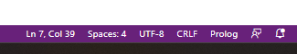

<p align="center"></p>

# 03 - Programando con PROLOG

## Primeros pasos
Como hemos visto en la guía anterior podemos hacer a PROLOG preguntas que requiren un razonamiento básico. Este nos responderá de forma lógica indicando si el enunciado dado es o no verdadero. Pero la potencia de PROLOG no termina aquí...

Prueba a escribir los siguientes enunciados en la terminal ¿Qué devuelve PROLOG en cada caso?:
* ```¿ama monica a chandler?.```
* ```ama(monica, chandler).```

En el primer caso tenemos un error de sintaxis ya que PROLOG no entiende que estamos expresando. En el segundo tenemos un error de "conocimiento", si bien la sintaxis es correcta PROLOG no sabe que le estamos preguntando al no poseer el conocimiento necesario. 

Para poder dotar a PROLOG de este conocimiento necesitamos crear una base de conocimiento y razonamiento, lo que denominaremos un programa en PROLOG. Las bases de conocimiento se componen de dos partes muy relevantes:

1. Los Hechos (*Facts*): son las ideas principales sobre las que basar el conocimiento, los pilares a partir de los cuales podemos comenzar nuestro razonamiento. Nuestra base de conocimiento. 
2. Las Reglas (*Rules*): son las reglas de inferencia sobre las cuales a partir de la base de conocimiento podemos relacionar, argumentar y responder a las preguntas. 

Es muy importante que el diseño del programa sea acorde con las preguntas que queremos responder. 

Veamos un ejemplo de programa en PROLOG, siguiendo el ejemplo de las preguntas anteriores. En el problema de Friends, necesitamos establecer los hechos, las verdades básicas del universo de conocimiento...

Para hacer todo esto necesitamos escribir un programa de Prolog, ya que necesitaremos especificar todo el conocimiento que luego cargaremos en SWI-PROLOG. Crea un fichero con el siguiente nombre ```friends.pl```. Puedes crear un fichero de texto y modificar su extensión para crearlo. 

</br> 

<div style="background-color:#ffe6e6; border-radius: 10px;">
<strong>Trabajando con extensiones</strong></br>
Hay sistemas operativos donde, por defecto, las extensiones de los archivos no son visibles. En el caso de Windows estas no son visibles por defecto. Puedes ver como habilitarlas en el siguiente <a href="https://www.howtogeek.com/205086/beginner-how-to-make-windows-show-file-extensions/">enlace</a>.
</div>

</br> 

<div style="background-color:#e6f3ff; border-radius: 10px;">
<strong>Visual Studio Code: Archivos Prolog</strong></br>
Cuando abres un archivo de código, Visual Studio identifica el lenguaje de programación mediante la extensión. En el caso de un <code>.pl</code> existen varios lenguajes de programación con que usan esta extensión. Verifica que Visual Studio está identificando correctamente la extensión en el lado derecho de la barra inferior de Visual. Deberá de poner Prolog, si pone otro lenguaje como PERL deberás de cambiarlo seleccionando el correcto. 

<p align="center"></p>

Para cambiar el lenguaje selecciona el nombre del lenguaje que aparece, un listado aparecerá donde puedes buscar el lenguaje que desees usar. 
</div>

</br> 

Nuestra primera verdad será que Mónica ama a Chandler...
Para ello deberemos de usar la sintaxis de PROLOG, necesitamos crear lo que entendemos como una proposición de primer orden, que contiene un predicado y sus individuos.

```prolog
% predicado(invdividuo1, ..., individuoN). 
ama(monica, chandler).
```

Fijate que usamos una nomenclatura ya vista en clase, es importante el punto final después de cada línea de código, siguiendo la sintaxis de Prolog. 

Ahora escribe en tu programa las siguientes premisas:

* Chandler ama a Mónica
* Joey ama a Rachel

<details><summary>Solución</summary>
<p>
Puedes escribir las premisas usando la misma función escrita anteriormente, pero cambiando los individuos.

```prolog
ama(chandler,monica).
ama(joey,rachel).
```

</p>
</details>

Ahora necesitamos establecer algunas reglas de inferencia que especifiquen a Prolog como debe de argumentar las preguntas que podemos realizar. 

Nuestras reglas serán las siguientes:
* Dos personas salen si se aman mutuamente.
* Dos personas son amigos si almenos uno de ellos ama al otro. 

Podemos representar la primera regla como:
$\forall x \forall y  (ama(x,y) \land ama(y,x) \to sale(x,y))$

Esta regla puede codificarse de la siguiente forma:

```prolog
sale(X,Y):- ama(X,Y), ama(Y,X).
```
 Como puedes ver invertimos el orden de la fórmula, primero escribimos el resultado y después explicamos como llegar a esa conclusión. ```:-``` es el símbolo que usaremos pare representar $\to$, después expresamos el conjunto de formulas que hacen falta para poder llegar a esa conclusión. Estas fórmulas ya se han definido anteriormente. 

 Es importante remarcar que las variables se escriben en mayúsculas. Por otro lado usamos la ```,``` para denotar un $\land$, en el caso de un $\lor$ usaremos el ```;```. Recuerda el punto final después de la línea de código. 

 Intenta representar la segunda regla.

 <details><summary>Solución</summary>
<p>
Puedes escribir la regla usando una estructure similar a la anterior. En lógica de primer orden lo escribiriamos así: $\forall x \forall y  (ama(x,y) \lor ama(y,x) \to amigos(x,y)) $

El código resultante:
```prolog
amigos(X,Y):- ama(X,Y); ama(Y,X).
```

</p>
</details>

Una vez terminado, ya podemos cargarlo en Prolog. Para ello guardar el archivo y ve a la terminal de Prolog.
Si te encuentras en la misma carpeta donde está el archivo que acabas de crear basta con escribir el siguiente comando en la terminal.

```bash
?- ['friends.pl'].
```
Si no te encuentras en el mismo directorio, puedes ir hasta ahí navegando desde la terminal o cargarlo directamente escribiendo toda la ruta hasta el archivo. 

Ahora ya hemos cargado la base de conocimiento y sus reglas en Prolog y podemos proceder a preguntar cosas. Prueba una a una las siguientes preguntas:
* ¿Ama Mónica a Chandler?
* ¿Ama Phoebe a Chandler?
* ¿Sale Mónica con Chandler?
* ¿Sale Chandler con Mónica?
* ¿Sale Rachel con Joey?
* ¿Son Mónica y Chandler amigos?
* ¿Son Gunter y Chandler amigos?

¿Qué te devuelve en cada caso? Recuerda que debes de usar la sintaxis que has diseñado para Prolog. Por ejemplo, la primera pregunta sería ```ama(monica,chandler).```

Por otro lado puedes hacer preguntas más genéricas y PROLOG intentará deducir la respuesta a partir de las reglas y la base de conocimiento. Por ejemplo, ¿a quién ama Mónica? 

Basta con escribir ```ama(monica,X).```, de esta forma PROLOG nos dirá que valor puede tomar X. Intenta responder a las siguientes preguntas:

* ¿Con quién sale Chandler?
* ¿Con quién sale Rachel?
* ¿De quién es amigo Joey?

Prueba a escribir ```salen(X,Y).``` o ```salen(X,X).```. ¿Qué pasa?

## Depurar un programa
Como puedes observar Prolog te devuelve directamente la respuesta a tu pregunta. Pero muchas veces podemos necesitar entender como está razonando Prolog. 

Prolog ya está creado para razonar usando la lógica, nosotros solo establecemos las reglas que deben de seguirse y las premisas de conocimiento. Para saber si el razonamiento creado es correcto podemos querer estudiar paso a paso que argumentos sigue Prolog en la generación de su respuesta. 

Para ello podemos activar la depuración (*debugging*), esta nos mostrará los pasos que se han seguido para dar repuesta. 

Escribe el siguiente comando en la terminal:
```bash
?- trace.
```

Ahora se habrá activado la función de depuración y Prolog devolverá la traza seguida para determinar la respuesta. Una vez ejecutada la pregunta, sigue presionando enter cada vez para que Prolog devuelva una a uno a uno los pasos. Prueba las preguntas anteriores y analiza que traza devuelve. 

Para salir del modo depuración escibre el comando ```notrace.```, volverá la terminal al funcionamiento original. 